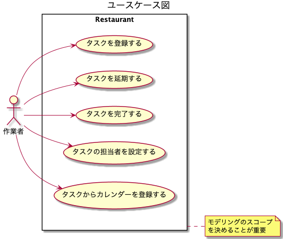

# ドメイン駆動設計

- 以下を読んだまとめを行う
  - （書籍）ドメイン駆動設計 モデリング/実装ガイド

## DDD概要

- DDDとは
  - ソフトウェア開発手法の1つ
    - ソフトウェア開発の目的
      - ある領域に存在する特定の問題を解決するため
      - ドメイン：その領域をさす
- モデル
  |モデル|概要|
  |---|---|
  |ドメインモデル|ドメインの問題を解決するためのモデル|
  |データモデル|データの永続化方法を決める（永続化方法の効率化という問題解決を行う）ためのモデル|
  - 良いモデル
    - 問題を解決できるモデル
    - 良いモデルを作る方法
      - ドメインエキスパートと会話する
        - ドメインエキスパート
          - アプリケーションで問題解決しようとする採用管理領域に詳しい人
      - 運用して得られた発見をモデルに還元する
        - リリースして運用してみたら意外な改善点が合ったなど、その発見をモデルに反映する
        - 最初からモデルは完成せず、徐々に改善していくもの
        - モデルを更新したら、コードも頻繁に変更する
          - 極力、モデルとコードの表現をオブジェクト指向を使って近づける
          - 軽量DDD
            - 頻繁な変更に耐えうる拡張性の高い設計のベストプラクティスのパターンのみを取り入れること
        - 重要な単語

        |単語|概要|
        |----|----------------|
        |ユビキタス言語|発見したモデルの言葉を全ての場所で使うという指針 開発者だけではなく、ビジネス側の人とも同じ言葉を使う。 会話でも、ドキュメントでも、コードでも。 方法は3つあるが、日本語と英語の対応を決めて変換するのが日本では多い。|
        |境界づけられたコンテキスト||
- 取り組む上で重要なこと
  - 課題ドリブン
    - ルールで決められているからこう、ではなく、目的を明確化して認識合わせをすることが重要
  - 小さく初めて小さく失敗する

## モデリングから実装まで

- ユースケース図の作成
  - ユーザの要求に対するシステムの振る舞いを定義する図
  - ユースケースを具体化しないとどのようなモデルを作成すれば良いか判断できないため
  - スコープを決める目的
    - 議論の範囲を狭めて限られた時間で成果を出せるようにするため

- ドメインモデル図
  - 簡易化したクラス図
    - ルール/制約
      - オブジェクトの生成や更新時に守らなければいけないルール
    - 集約
      - 表現方法
        - 集約内の参照はインスタンス参照となる
        - 集約外の参照はID参照となる
- ドメイン層オブジェクト設計の基本方針
  - ドメインモデルの知識を対応するオブジェクトに書く
    - ドメイン知識（ルール/制約）を表現する実装を、ドメイン層のオブジェクトに寄せていく
  - 常に正しいインスタンスしか存在させない
    - その方法
      |方法|概要|
      |-------|------------------|
      |生成条件の強制|全てのインスタンスはコンストラクタ、もしくはファクトリーメソッドを経由して生成される。 デフォルトコンストラクタを放置せず、意味のあるメソッドだけ存在するようにする|
      |ミューテーション条件の強制|全ての内部状態の変更が正しいようにする。 全ての項目に対するセッターをpublicにすると他のusecaseクラスで自由に不整合なデータを作成できてしまう。また仕様を追いかけるのに、多くのクラスをコード参照から追う必要がある。|

## DDD固有のモデリング手法

- 集約
  - 必ず守りたい強い生合成をもったオブジェクトのまとまり
  - ドメインモデリングでは、全てのオブジェクトはいずれかの集約に所属するようにする
    - 集約のオブジェクトを扱うときの親となるオブジェクトを集約ごとに1決め、そのオブジェクトを「集約ルート」と呼ぶ
  - 設計、実装時のルール
    - 強い整合性確保が必要なものを1つの集約にする
    - トランザクションを必ず1つにする
      - 1つの集約のオブジェクトは、必ず集約単位でリポジトリから取得し、集約単位でリポジトリに渡す
      - 目的
        - 集約内のオブジェクトの整合性が崩れるのを防ぐ
  - 集約の境界
    - 整合性を確保する必要性の強さ
      - 複数の集約の間での整合性を確保しないわけではないが、実装上のコストや難易度が上がるため、その必要性の強さに基づいて判断する
    - トランザクションの範囲の適切さ
      - 集約の範囲を大きくすると、データベースに対して必要以上に大きなロックをとるため、問題が発生する
- 境界づけられたコンテキスト
  - モデルの共有
    - 発見したモデルの言葉を全ての場所で使うという指針、に従い、関係者すべてで統一したモデルを作成することは、システムが大規模になると難しい
    - 上記の解決策として、モデルが適用される範囲を明示的に定義し、それぞれの中でモデル、言語の統一を目指す
      - 例えば、商品といった時に、販売部がイメージする商品と、配送部がイメージする商品は、異なるので、それは別のコンテキストと言える
    - シンプルなのは、「1アプリケーション1コンテキスト」
      - 1つのコンテキストごとに、1つのオニオンアーキテクチャなどに沿った実装をする
        - つまりマイクロサービスになる
        - **だが、実際は実装上のコストが大きいため、これをアレンジする必要がある**
      - コンテキスト同士の通信方法
        |通信方法|概要|
        |-------|----------------|
        |同期通信|ネットワーク経由のダイレクトコール（REST APIなど）|
        |非同期通信|メッセージキューを利用したイベント通信（AWS SQS）|
    - 1コンテキスト1アプリケーション以外の場合
      - パッケージなどで分割して表現する

## ドメイン層の実装

- ドメインモデルを表現するもの（ドメインオブジェクト）

|種類|概要|
|-----------|---------------------|
|エンティティ（モノ）|同一判定を識別子で行う（例えば社員のモデルの場合は、社員番号など） エンティティは可変。|
|値オブジェクト（モノ）|同一判定を保持する値で行う（例えばお金で考えると、2つの10円玉があった場合、その2つを区別する必要はない場合は値オブジェクト） また、値オブジェクト自体は不変。10円玉は製造されたらその価値が100円になったりすることはない。|
|ドメインサービス|モデルをオブジェクトとして表現すると無理があるもの、の表現に使う 極力エンティティと値オブジェクトで実装して、どうしても避けられない場合に使う！|
|ドメインイベント（コト）||

- ドメインオブジェクトを利用するもの

|種類|概要|
|-----------|---------------------|
|リポジトリ||
|ファクトリー||
|ドメインサービス||

## 参考

- [sergdort/CleanArchitectureRxSwift](https://github.com/sergdort/CleanArchitectureRxSwift)
- [クリーンアーキテクチャ完全に理解した](https://gist.github.com/mpppk/609d592f25cab9312654b39f1b357c60)
- [Swift/iosで開発するドメイン駆動~DDD(風)なモダンなアーキテクチャ](https://qiita.com/ko2ic/items/6ac7321189e8c3ac1665)
- [お前らがModelと呼ぶアレをなんと呼ぶべきか。近辺の用語(EntityとかVOとかDTOとか)について整理しつつ考える](https://qiita.com/takasek/items/70ab5a61756ee620aee6)
